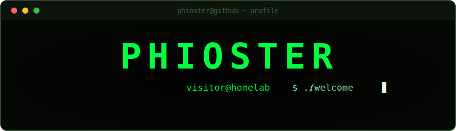

<!-- Profile README for github.com/Phioster — matrix-terminal themed -->

<div align="center">



<a href="#"></a>


</div>

---

### ▚▚ `./about`

```text
[stack]   Kotlin · Jetpack Compose · Android
[focus]   self-hosted / homelab · clean native UIs
[vibe]    matrix-terminal green, everywhere
```
<!-- optional: eine Zeile über dich (Land, Interessen …) oder diese Zeile löschen -->

### ▚▚ `./featured`

> **🟢 Sanctumd** — one native Android app for your whole self-hosted stack:
> **Jellyfin admin** + the **\*arr / download / request** stack, in a single
> matrix-terminal UI. No backend, no account — every action hits each service's
> own API directly.
>
> <sub>_Repo-Card erscheint hier automatisch, sobald `sanctum_daemon` public ist._</sub>

<!-- Nach dem Public-Schalten diese Card einkommentieren:
<a href="https://github.com/Phioster/sanctum_daemon">
  
</a>
-->

### ▚▚ `./stack`

<p>


</p>

### ▚▚ `./stats`

<div align="center">


</div>

<!-- Optional: animierte Contribution-"Snake" — läuft nach dem ersten Action-Run.
     Braucht die Datei .github/workflows/snake.yml (liegt im Ordner bei).
<div align="center">

</div>
-->

---

<div align="center">
<sub><code>EOF — thanks for scrolling 🟢</code></sub>
</div>
