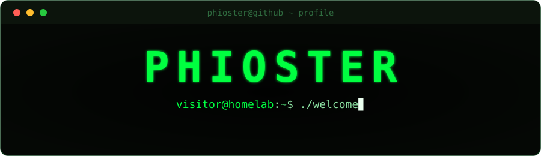
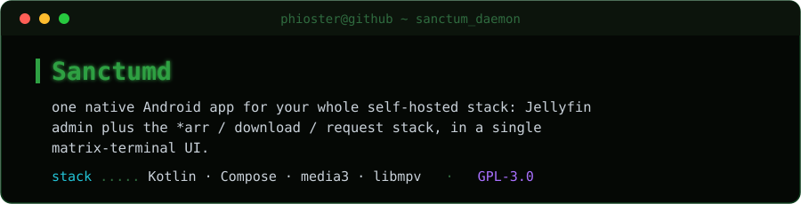
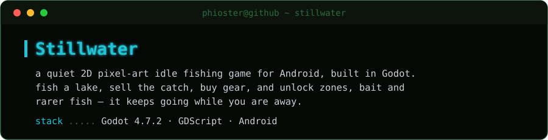
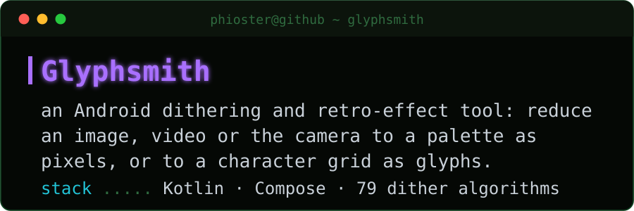
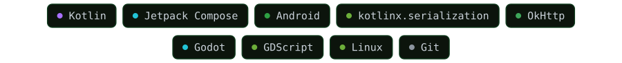
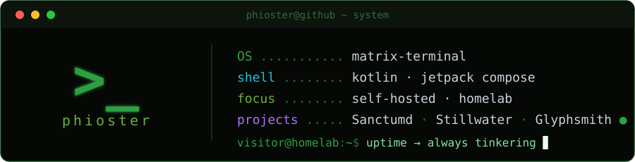

<!-- Profile README for github.com/Phioster — matrix-terminal themed -->

<div align="center">




</div>

---


```text
[stack]  Kotlin · Compose · Android · Godot
[focus]  self-hosted / homelab · native UIs
[vibe]   matrix-terminal green, everywhere
```


<a href="https://github.com/Phioster/sanctum_daemon">
  
</a>

<a href="https://github.com/Phioster/stillwater">
  
</a>

<a href="https://github.com/Phioster/glyphsmith">
  
</a>





<div align="center">



</div>

<div align="center">


</div>


